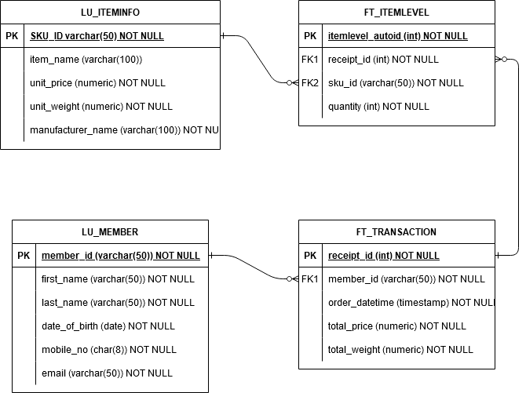

# Section 2 - Databases

# Problem Statement

You are appointed by the above e-commerce company to create a database infrastructure for their sales transactions. Purchases are being made by members of the e-commerce company on their website (you may use the first 50 members of a processed dataset from Section 1). Members can make multiple purchases. 

The following are known for each item listed for sale on the e-commerce website:

* Item Name
* Manufacturer Name
* Cost
* Weight (in kg)

Each transaction made by a member contains the following information:

* Membership ID
* Items bought (could be one item or multiple items)
* Total items price
* Total items weight

Set up a PostgreSQL database using the Docker [image](https://hub.docker.com/_/postgres) provided. We expece at least a Dockerfile which will stand up your database with the DDL statements to create the necessary tables. You are required to produce  entity-relationship diagrams as necessary to illustrate your design. 

Analysts from the e-commerce company will need to query some information from the database. Below are 2 of the sameple queries from the analysts. Do note to design your database to account for a wide range of business use cases and queries. 
You are tasked to write a SQL statement for each of the following task:
1. Which are the top 10 members by spending
2. Which are the top 3 items that are frequently brought by members

# Setting up the data base

With the working directory as `2 - Databases`, run the following command:

```docker compose up -d --build```

# Data Definition



## FT_TRANSACTION

There will be two tables, FT_TRANSACTION and FT_ITEMLEVEL for keeping sales data at the receipt level, and the item level respectively. This is because in previous experience, there are a number of receipt-level calculations performed that are not really compatible with item-level granularity, such as discounts. Therefore, it is better to keep both a receipt-level table that can keep overall discounted purchase prices, etc. and also an item-level table with information of the items in each receipt.

* receipt_id: Primary key of the table, refers to an internal ID number for each receipt.
* member_id: The member ID of the member who made this purchase/transaction. 
* order_datetime: The date and time at which the order was placed.
* total_price: The total purchase price of the transaction, taken as a whole.
* total_weight: The total weight of the items sold in the transaction (in kg).

## FT_ITEMLEVEL

Contains item-level information of the data.

* itemlevel_autoid: An automatically-incrementing integer that serves as the primary key for this table, since there will be duplicate receipt_id if a receipt has more than 1 different item.
* receipt_id: Foreign key from FT_TRANSACTION used to identify the receipt which is containing the individual item sold.
* sku_id: The Stock-keeping unit (SKU) ID of the item sold.
* quantity: The quantity of the item bought in the receipt, measured in stock-keeping units (SKUs).

## LU_ITEMINFO

Contains descriptive information about the items available in the e-commerce company.

* sku_id: The Stock-keeping unit ID of an item, used to distinguish different items from one another. This will serve as the primary key since it is like an NRIC for each possible item sold.
* item_name: A descriptive readable name to describe the item.
* unit_price: The default price of the item sold, before discounts.
* unit_weight: The weight of one SKU of the item (in kg).
* manufacturer_name: The name of the manufacturer of the item.

## LU_MEMBER

Contains information about the members registered to the e-commerce company, their membership applications were processed in Section 1 and hence the information saved is the same.

* member_id: Member ID generated via their last name and the first 5 digits of the SHA256 hash of their burthday in YYYYMMDD.
* first_name: First Name of the member.
* last_name: Last Name of the member.
* date_of_birth: Date of Birth of the member.
* mobile_no: 8-digit mobile number of the member, without country codes or any other symbols.
* email: E-mail address of the member.

# Queries

### To see the top 10 members by spending

```sql
select member_id, sum(total_price) total_spending 
from ft_transaction 
group by member_id 
order by total_spending desc 
limit 10;
```

### To see the top 3 items frequently bought by members

It is currently unclear whether "frequently" refers to number of times each item shows up in receipts, or whether it is total number of SKUs sold.

If the former:

```sql
select b.item_name, a.sku_id, count(distinct a.receipt_id) total_receipts 
from ft_itemlevel a 
join lu_iteminfo b on a.sku_id = b.sku_id
group by b.item_name, a.sku_id
order by receipts desc 
limit 3
```

If the latter:

```sql
select b.item_name, a.sku_id, sum(a.quantity) total_quantity 
from ft_itemlevel a 
join lu_iteminfo b on a.sku_id = b.sku_id 
group by b.itemname, a.sku_id
order by total_quantity desc 
limit 3
```