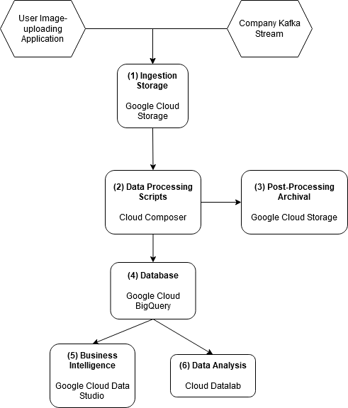

# Section 3: System Design

## 1 - Ingestion Storage

Google Cloud Storage can be used for the ingestion of data. The user applications and Kafka applications can use the provided Google Cloud Storage API to authenticate and upload the desired images into a bucket where it can be read from by the processing scripts.

## 2 - ETL Scripts

While details on the exact image processing performed is not entirely clear, for the moment it will be assumed that they are Python scripts. Python scripts can be run as DAGs in Cloud Composer, which also has the functionality of scheduling the jobs to be run and in which sequence the scripts are supposed to be run. Cloud Composer can dynamically spin up workers as needed for pipeline jobs so that less attention has to be paid to provisioning of resources while offering direct integration with other services like Cloud Storage, where for example files can be directly accessed from buckets through the gs:// URIs.

Depending on the type of processing on the images performed, other tools may be more suitable. Cloud Dataproc or Compute Engine VMs with Apache Spark may be more suitable for running large batch jobs with machine learning involved.

## 3 - Post-processing Archival

A requirement is for images that were processed and their metadata to be stored for up to 7 days. As part of the ETL Scripts run, the images processed and associated metadata can be kept in a separate Google Cloud Storage Bucket with a set of Object Lifecycle Management rules configured, which can automatically delete all files that are older than a certain age (in this case, 7 days).

## 4 - Database

While the exact form of the data being stored is not clear, Cloud BigQuery is a reasonably well-performing database that scales well. It stores its data in a columnar format which makes it conducive to data analysis, since selected columns in each calculation can be looked at without loading the rest of the rows of the data. BigQuery is also integrated with other products that can make visualisation more convenient.

## 5 & 6 - Business Intelligence and Data Analysis

Google Data Studio is a platform by which the BigQuery data can be accessed to make dynamic dashboards which react to selections of data, so graphs and charts can automatically react to filters when the end-users are interested in particular slices of data. If more in-depth, custom data analysis is required, Google Cloud Datalab is an implementation of a notebook similar to Jupyter that can access BigQuery data as well. Both products are available at no cost for analysis; the relevant costs will be associated with BigQuery database query traffic.