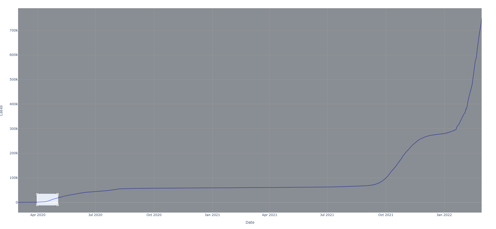
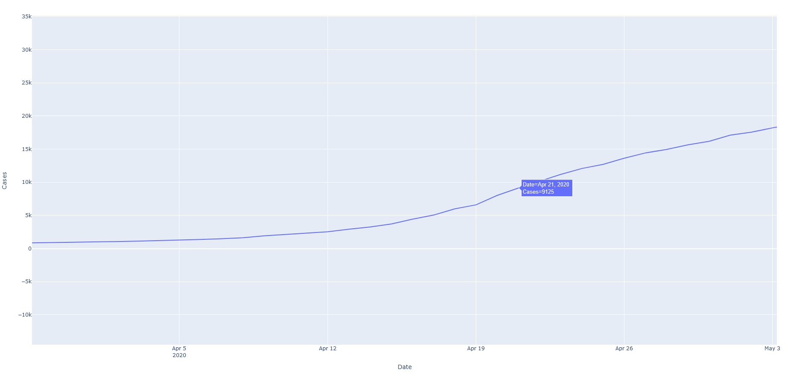

# Readme

The code in `generate_graph.py` was used to create an interactive graph via the package Plotly. Plotly allows zooming in and out of the data visualisation to either specific x-axis or y-axis ranges, and also provides descriptive labels for each data point so that, for example, it is possible to tell exactly what was the total number of Cases at October 21, 2021. Please visit https://t-s-w.github.io/Data-Engineer-Tech-Challenge-Answers/ to have a look!

Alternatively, I also created a Google Data Studio Community Connector for Data Studio to be able to access this API to make dashboards as well. An example dashboard can be seen at https://lookerstudio.google.com/reporting/76b3bb13-2a45-4207-aba1-aced6bfa5e47

